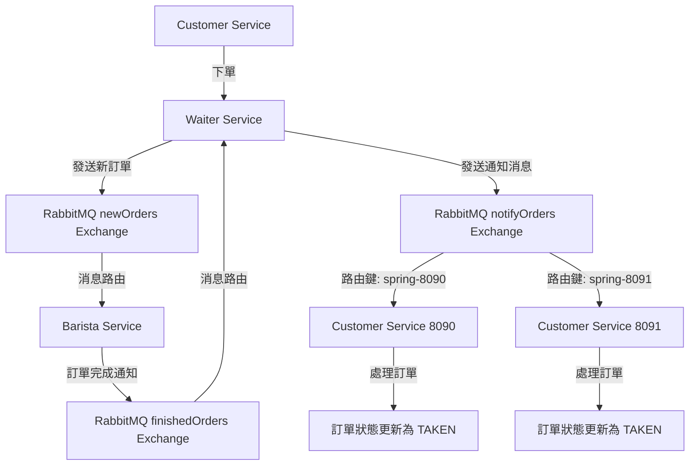

# Lazy Customer Service 🛋️

[](https://www.oracle.com/java/)
[](https://spring.io/projects/spring-boot)
[](https://spring.io/projects/spring-cloud-stream)
[](https://www.rabbitmq.com/)

## 專案介紹

Lazy Customer Service 是一個採用事件驅動架構的客戶服務微服務，專為追求高效能和非阻塞式處理的場景設計。與傳統的輪詢方式不同，此服務採用消息驅動模式，當訂單完成時會主動收到通知，無需定期查詢訂單狀態。

### 核心功能
- 建立和管理咖啡訂單
- 接收來自 Waiter Service 的訂單完成通知
- 自動更新訂單狀態為已取餐（TAKEN）
- 支援多實例部署，每個實例獨立處理自己的訂單

> 💡 **為什麼選擇此服務？**
> - 採用事件驅動架構，響應速度更快
> - 減少不必要的網路請求，節省系統資源
> - 支援水平擴展，可同時運行多個實例
> - 基於路由鍵的精確消息分發機制

### 🎯 專案特色

- **事件驅動**：基於消息通知而非輪詢機制
- **精確路由**：使用客戶名稱作為路由鍵，確保消息精確送達
- **水平擴展**：支援多實例部署，每個實例處理特定客戶群
- **容錯設計**：內建 Resilience4j 熔斷器機制

## 技術棧

### 核心框架
- **Spring Boot 3.4.5** - 微服務基礎框架
- **Spring Cloud Stream 4.x** - 消息驅動微服務框架
- **Spring Cloud OpenFeign** - 服務間 HTTP 通信
- **Resilience4j** - 熔斷器、限流和重試機制

### 開發工具與輔助
- **Maven** - 專案建構與依賴管理
- **Lombok** - 減少樣板代碼
- **Consul** - 服務註冊與發現
- **RabbitMQ** - 消息代理中間件

## 專案結構

```
lazy-customer-service/
├── src/
│   ├── main/
│   │   ├── java/
│   │   │   └── tw/fengqing/spring/springbucks/customer/
│   │   │       ├── integration/          # 消息整合層
│   │   │       │   ├── NotificationListener.java # 訂單通知監聽器
│   │   │       │   └── Waiter.java          # Waiter 服務介面定義
│   │   │       ├── controller/           # REST API 控制器
│   │   │       │   └── CustomerController.java # 客戶控制器
│   │   │       ├── model/                # 資料模型
│   │   │       │   ├── Coffee.java           # 咖啡實體
│   │   │       │   ├── CoffeeOrder.java      # 訂單實體
│   │   │       │   ├── OrderState.java       # 訂單狀態枚舉
│   │   │       │   ├── NewOrderRequest.java  # 新訂單請求
│   │   │       │   └── OrderStateRequest.java # 訂單狀態更新請求
│   │   │       ├── service/              # 業務邏輯層
│   │   │       │   ├── CoffeeOrderService.java # 訂單服務
│   │   │       │   └── WaiterService.java    # Waiter 服務代理
│   │   │       └── CustomerServiceApplication.java # 應用程式啟動類
│   │   └── resources/
│   │       └── application.properties    # 應用程式配置
│   └── test/                            # 測試程式碼
├── pom.xml                              # Maven 專案配置
└── README.md                            # 專案說明文件
```

## 快速開始

### 前置需求
- Java 21 或更高版本
- Maven 3.6 或更高版本
- RabbitMQ 3.11.0 或更高版本
- Consul（服務註冊與發現）
- Busy Waiter Service（依賴服務）

### 安裝與執行

1. **克隆此倉庫：**
```bash
git clone <repository-url>
cd lazy-customer-service
```

2. **啟動依賴服務：**
```bash
# 啟動 RabbitMQ
docker run -d --name rabbitmq -p 5672:5672 -p 15672:15672 rabbitmq:3.11-management

# 啟動 Consul
consul agent -dev

# 啟動 Busy Waiter Service
cd ../busy-waiter-service
mvn spring-boot:run
```

3. **編譯專案：**
```bash
mvn clean compile
```

4. **執行應用程式：**
```bash
# 單一實例執行
mvn spring-boot:run

# 多實例執行（用於測試消息路由）
# 終端1：啟動客戶端1（端口8090）
mvn spring-boot:run -Dspring-boot.run.arguments="--server.port=8090"

# 終端2：啟動客戶端2（端口8091）
mvn spring-boot:run -Dspring-boot.run.arguments="--server.port=8091"

# 或使用 JAR 方式執行
# java -jar target/lazy-customer-service-0.0.1-SNAPSHOT.jar --server.port=8090
# java -jar target/lazy-customer-service-0.0.1-SNAPSHOT.jar --server.port=8091
```

## 進階說明

### 環境變數
```properties
# 服務端口設定（0 表示隨機分配）
SERVER_PORT=0

# 客戶名稱設定（基於服務端口）
CUSTOMER_NAME=spring-${server.port}

# RabbitMQ 連線設定
SPRING_RABBITMQ_HOST=localhost
SPRING_RABBITMQ_PORT=5672
SPRING_RABBITMQ_USERNAME=spring
SPRING_RABBITMQ_PASSWORD=spring

# Consul 服務註冊設定
SPRING_CLOUD_CONSUL_HOST=localhost
SPRING_CLOUD_CONSUL_PORT=8500
```

### 設定檔說明
```properties
# application.properties 主要設定
# 動態端口分配
server.port=0

# 客戶名稱（用於消息路由）
customer.name=spring-${server.port}

# Spring Cloud Stream 函數式編程模型配置
spring.cloud.function.definition=notifyOrders

# RabbitMQ 輸入綁定配置 - 接收訂單完成通知
spring.cloud.stream.bindings.notifyOrders-in-0.destination=notifyOrders
spring.cloud.stream.bindings.notifyOrders-in-0.group=customer-service-${server.port}
spring.cloud.stream.rabbit.bindings.notifyOrders-in-0.consumer.binding-routing-key=${customer.name}
spring.cloud.stream.rabbit.bindings.notifyOrders-in-0.consumer.durable-subscription=true

# Resilience4j 熔斷器配置
resilience4j.circuitbreaker.instances.order.failure-rate-threshold=50
resilience4j.circuitbreaker.instances.order.wait-duration-in-open-state=5000
resilience4j.circuitbreaker.instances.order.ring-buffer-size-in-closed-state=5
```

### 消息路由機制



### RabbitMQ Exchange 說明

| Exchange 名稱 | 用途 | 路由方式 | 參與服務 |
|---------------|------|----------|----------|
| `newOrders` | 新訂單通知 | Direct | Waiter Service → Barista Service |
| `finishedOrders` | 訂單完成通知 | Direct | Barista Service → Waiter Service |
| `notifyOrders` | 客戶通知 | Direct (基於路由鍵) | Waiter Service → Customer Service |

### API 端點

| 方法 | 路徑 | 描述 |
|------|------|------|
| POST | `/customer/order` | 建立新訂單 |
| GET | `/customer/orders` | 取得所有訂單列表 |
| GET | `/customer/orders/{id}` | 取得特定訂單詳情 |

## 開發指南

### 重要程式碼區塊註解

#### NotificationListener.java - 訂單通知監聽器
```java
/**
 * 訂單完成通知監聽器
 * 採用函數式編程模型，監聽來自 Waiter Service 的訂單完成通知
 * 當收到通知時，自動將訂單狀態更新為已取餐（TAKEN）
 */
@Component
@Slf4j
public class NotificationListener {
    
    @Autowired
    private CoffeeOrderService orderService;
    
    @Value("${customer.name}")
    private String customer;

    /**
     * 訂單通知處理函數
     * 使用函數式編程模型定義消息處理邏輯
     * @return Consumer<Long> 訂單ID處理函數
     */
    @Bean
    public Consumer<Long> notifyOrders() {
        return id -> {
            log.info("=== 收到訂單通知 ===");
            log.info("訂單ID: {}", id);
            log.info("當前客戶名稱: {}", customer);
            
            // 取得訂單詳情
            CoffeeOrder order = orderService.getOrder(id);
            log.info("訂單詳情: {}", order);
            
            // 檢查訂單狀態是否為製作完成
            if (order != null && OrderState.BREWED == order.getState()) {
                log.info("Order {} is READY, I'll take it.", id);
                // 更新訂單狀態為已取餐
                orderService.updateState(id,
                        OrderStateRequest.builder().state(OrderState.TAKEN).build());
            } else {
                log.warn("Order {} is NOT READY. Current state: {}. Why are you notify me?",
                        id, order != null ? order.getState() : "null");
            }
            log.info("=== 處理完成 ===");
        };
    }
}
```

#### CustomerController.java - 客戶控制器
```java
/**
 * 客戶訂單控制器
 * 提供訂單建立和查詢的 REST API 端點
 */
@RestController
@RequestMapping("/customer")
@Slf4j
public class CustomerController {
    
    @Autowired
    private CoffeeOrderService orderService;
    
    @Value("${customer.name}")
    private String customer;

    /**
     * 建立新訂單
     * 客戶下單後，訂單狀態會自動設為已付款（PAID）
     * 並透過 Waiter Service 開始製作流程
     * 
     * @return CoffeeOrder 建立的訂單物件
     */
    @PostMapping("/order")
    @Bulkhead(name = "order", type = Bulkhead.Type.THREADPOOL)
    public CoffeeOrder createOrder() {
        // 建立新訂單請求
        NewOrderRequest newOrder = NewOrderRequest.builder()
                .customer(customer)  // 使用動態客戶名稱
                .items(Arrays.asList(
                        CoffeeOrderItemRequest.builder()
                                .coffee("capuccino")
                                .build()))
                .build();
        
        log.info("Create new order: {}", newOrder);
        // 建立訂單並返回結果
        CoffeeOrder order = orderService.createOrder(newOrder);
        log.info("Created order: {}", order);
        return order;
    }
}
```

#### CoffeeOrderService.java - 訂單服務
```java
/**
 * 訂單服務介面實作
 * 負責訂單的 CRUD 操作和狀態管理
 */
@Service
@Slf4j
public class CoffeeOrderService {
    
    @Autowired
    private CoffeeOrderRepository orderRepository;
    
    @Autowired
    private WaiterService waiterService;

    /**
     * 建立新訂單
     * 訂單建立後會自動設為已付款狀態，並通知 Waiter Service
     * 
     * @param newOrder 新訂單請求
     * @return CoffeeOrder 建立的訂單物件
     */
    public CoffeeOrder createOrder(NewOrderRequest newOrder) {
        // 計算訂單總金額
        CoffeeOrder order = CoffeeOrder.builder()
                .customer(newOrder.getCustomer())
                .items(newOrder.getItems())
                .state(OrderState.INIT)
                .build();
        
        // 儲存訂單並設定為已付款狀態
        orderRepository.save(order);
        order.setState(OrderState.PAID);
        orderRepository.save(order);
        
        // 通知 Waiter Service 處理訂單
        waiterService.createOrder(order);
        return order;
    }

    /**
     * 更新訂單狀態
     * 使用熔斷器保護，防止 Waiter Service 不可用時影響本服務
     * 
     * @param id 訂單ID
     * @param orderState 新的訂單狀態
     * @return boolean 更新是否成功
     */
    public boolean updateState(Long id, OrderStateRequest orderState) {
        // 使用熔斷器保護的遠端呼叫
        return waiterService.updateOrderState(id, orderState);
    }
}
```

## 監控與除錯

### 健康檢查端點
- `/actuator/health` - 應用程式健康狀態
- `/actuator/info` - 應用程式資訊
- `/actuator/circuitbreakers` - 熔斷器狀態
- `/actuator/metrics` - 應用程式指標

### 日誌配置
```properties
# 啟用 Spring Cloud Stream 除錯日誌
logging.level.org.springframework.cloud.stream=DEBUG
logging.level.tw.fengqing.spring.springbucks.customer=DEBUG
```

### 多實例測試
```bash
# 啟動多個實例進行消息路由測試
# 終端1
mvn spring-boot:run -Dspring-boot.run.arguments="--server.port=8090"

# 終端2
mvn spring-boot:run -Dspring-boot.run.arguments="--server.port=8091"

# 分別向不同端口下單，驗證消息路由
curl -X POST "http://localhost:8090/customer/order"
curl -X POST "http://localhost:8091/customer/order"

# 預期結果：
# - 訂單1只會通知到 8090 實例
# - 訂單2只會通知到 8091 實例
# - 兩個實例互不干擾，實現精準路由
```

## 參考資源

- [Spring Cloud Stream 官方文件](https://spring.io/projects/spring-cloud-stream)
- [Resilience4j 官方文件](https://resilience4j.readme.io/)
- [RabbitMQ 路由機制說明](https://www.rabbitmq.com/tutorials/tutorial-four-spring-amqp.html)

## 注意事項與最佳實踐

### ⚠️ 重要提醒

| 項目 | 說明 | 建議做法 |
|------|------|----------|
| 消息路由 | 確保路由鍵唯一性 | 使用客戶名稱+端口號作為路由鍵 |
| 服務依賴 | 避免強依賴 Waiter Service | 使用熔斷器保護遠端呼叫 |
| 狀態管理 | 訂單狀態一致性 | 實作樂觀鎖機制 |
| 多實例部署 | 避免消息重複處理 | 使用不同的 consumer group |

### 🔒 最佳實踐指南

- **消息設計**：使用明確的消息格式和客戶識別
- **錯誤處理**：實作完整的異常處理和日誌記錄
- **監控指標**：監控消息處理延遲和熔斷器狀態
- **資源管理**：合理配置連線池和執行緒池
- **安全性**：使用 TLS 加密消息傳輸
- **測試策略**：使用多實例測試驗證消息路由機制

### 常見問題排解

1. **消息未收到**：檢查路由鍵配置和 consumer group 設定
2. **重複處理**：確保每個實例使用不同的 consumer group
3. **熔斷器開啟**：檢查 Waiter Service 是否正常運行
4. **端口衝突**：使用 `server.port=0` 自動分配端口

## 授權說明

本專案採用 MIT 授權條款，詳見 LICENSE 檔案。

## 關於我們

我們主要專注在敏捷專案管理、物聯網（IoT）應用開發和領域驅動設計（DDD）。喜歡把先進技術和實務經驗結合，打造好用又靈活的軟體解決方案。

## 聯繫我們

- **FB 粉絲頁**：[風清雲談 | Facebook](https://www.facebook.com/profile.php?id=61576838896062)
- **LinkedIn**：[linkedin.com/in/chu-kuo-lung](https://www.linkedin.com/in/chu-kuo-lung)
- **YouTube 頻道**：[雲談風清 - YouTube](https://www.youtube.com/channel/UCXDqLTdCMiCJ1j8xGRfwEig)
- **風清雲談 部落格**：[風清雲談](https://blog.fengqing.tw/)
- **電子郵件**：[fengqing.tw@gmail.com](mailto:fengqing.tw@gmail.com)

---

**📅 最後更新：2025-10-21**  
**👨‍💻 維護者：風清雲談團隊**
